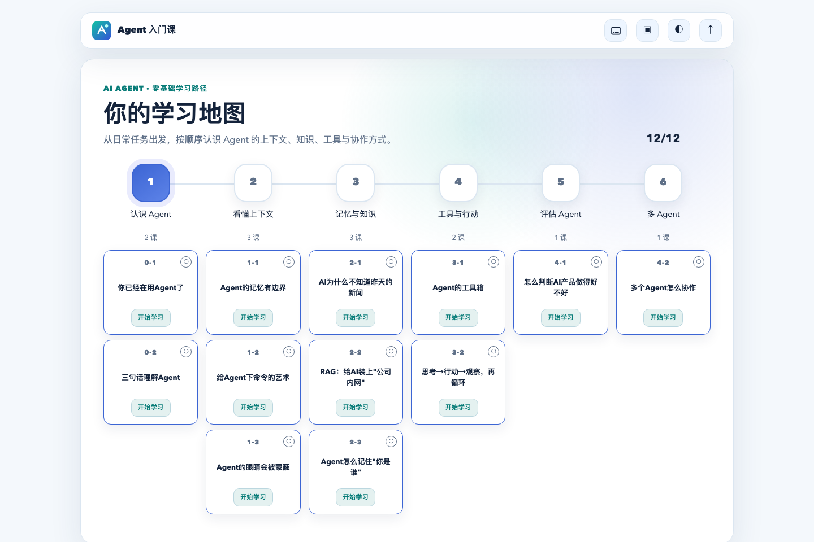
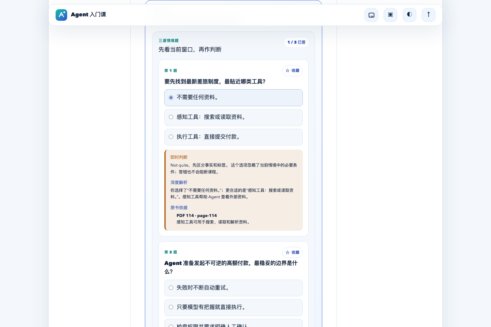
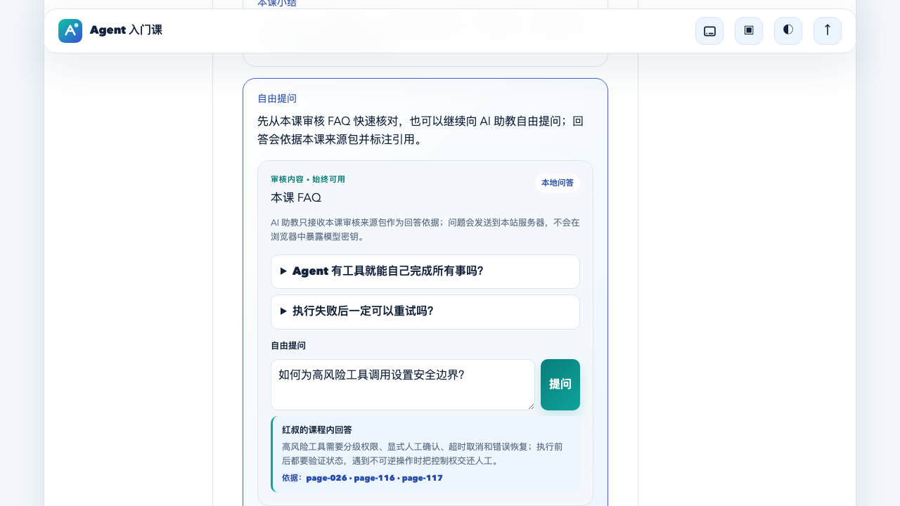
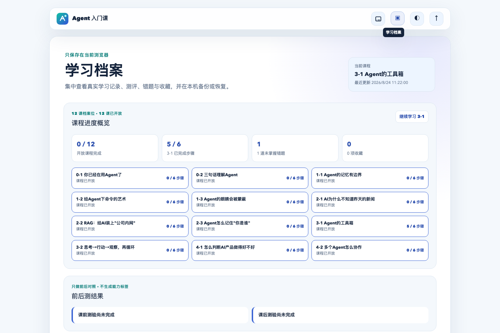

<div align="center">

# Agent 入门课

一门面向非技术学习者的开源 AI Agent 互动课程。

用 12 节结构化课程、情境练习、AI 助教和学习档案，系统理解 Agent 的上下文、知识、工具与协作。

[](https://my-agent-learning.vercel.app)
[](https://songhonglei.github.io/ai-agent-learning/)
[](LICENSE)

</div>



## 为什么做这个项目

很多 AI Agent 内容要么停留在概念罗列，要么默认学习者已经熟悉模型、工具调用和工程术语。这个项目尝试换一种方式：从日常工作任务出发，把“看懂、判断、练习、追问、复习”串成一条可完成的学习路径。

> **Agent = LLM + 上下文 + 工具**<br />
> 也可以理解成：**大脑 + 眼睛 + 手脚**

项目适合想系统理解 Agent、但不希望先啃技术文档的产品经理、运营、设计师、业务人员和其他好奇的学习者。

## 在线体验

- **课程应用**：[my-agent-learning.vercel.app](https://my-agent-learning.vercel.app)
- **项目展示页**：[songhonglei.github.io/ai-agent-learning](https://songhonglei.github.io/ai-agent-learning/)

公开版本保留完整访客体验：无需注册即可学习，进度默认保存在当前浏览器，也可以直接使用 AI 自由问答。

## 产品截图

| 情境测验 | AI 助教 |
|---|---|
|  |  |
| 选完立即获得判断、解析与原书依据 | 自由提问，并返回逐课审核来源引用 |

| 学习地图 | 学习档案 |
|---|---|
|  |  |
| 六个模块串起完整认知框架 | 集中管理进度、测评、错题、收藏与备份 |

## 核心功能

- **12 节完整课程**：覆盖 Agent 基础认知、上下文、知识与 RAG、记忆、工具、ReAct、评估和多 Agent 协作。
- **连续互动学习**：每课包含情境导入、对话讲解、互动实验、情境测验、本课小结与自由提问。
- **有依据的 AI 助教**：服务端只向模型提供当前课程审核来源包，回答附带引用，不在浏览器暴露模型密钥。
- **学习档案**：记录课程进度、前后测、错题、收藏和复习状态，支持 JSON 备份与恢复。
- **访客优先**：不登录也能完整学习、保存进度并使用 AI 问答；Supabase 登录是可选增强能力。
- **双主题与响应式界面**：适配亮色、深色及桌面/移动端布局，并覆盖基础无障碍交互。
- **同仓双部署**：共享课程内核与视觉界面，同时支持公网 Internet 模式和企业 Cowork SSO 模式。

## 一份代码，两种部署模式

应用采用“一个开源仓库、两种隔离部署”的架构。课程内容、学习引擎、档案格式和 UI 共享；身份、数据库与 AI 运行时按目标平台切换。

| 能力 | Internet / Vercel | Cowork / 企业内网 |
|---|---|---|
| 默认身份 | 访客，可选邮箱 OTP | 企业 SSO 自动识别 |
| 学习档案 | localStorage，可选 Supabase | 企业 PostgreSQL |
| AI 运行时 | 服务端模型网关 | 企业内部 Runway |
| 未登录体验 | 完整学习 + AI 自由问答 | 不适用 |
| 数据边界 | 公网账号与访客本地数据 | 企业账号内部数据 |

两端不会共享用户表和学习数据。需要迁移时，可以导出不含身份与令牌的学习档案 JSON。完整兼容策略见 [双部署改造计划](docs/project/dual-deployment-refactor-plan.md)。

## 快速开始

### 环境要求

- Node.js 20+
- npm 10+

### 本地运行

```bash
git clone https://github.com/Songhonglei/ai-agent-learning.git
cd ai-agent-learning
npm install
npm run dev
```

浏览器打开 `http://localhost:5173`。默认启动 Internet 模式；即使没有配置 Supabase 或模型服务，课程、练习和本地学习档案仍可使用。

也可以显式选择运行目标：

```bash
npm run dev:internet
npm run dev:cowork
```

### 启用本地 AI 自由问答

复制示例配置，并填写兼容 OpenAI Chat Completions 协议的服务器端模型网关：

```bash
cp config/ai.env.example config/ai.env
npm run serve:ai
```

`config/ai.env`：

```text
AI_BASE_URL=https://your-gateway.example/v1
AI_API_KEY=server-only-secret
AI_API_STYLE=openai-chat-completions
AI_MODEL=your-model-name
AI_TIMEOUT_MS=20000
```

密钥只由 Node 服务读取。不要给 `AI_API_KEY` 添加 `VITE_` 前缀，也不要把真实配置提交到仓库。

## Vercel 部署

Fork 仓库并导入 Vercel 后，基础课程应用无需额外配置即可构建。若要启用 AI 助教，请添加上面的 `AI_*` 服务器环境变量。

若要启用邮箱 OTP 登录与云端学习档案：

1. 创建 Supabase 项目。
2. 执行 `infrastructure/supabase/migrations/` 中的两份迁移。
3. 在 Supabase Authentication 中配置 Site URL、Redirect URLs 与生产 SMTP。
4. 在 Vercel 添加：

```text
VITE_SUPABASE_URL=https://your-project.supabase.co
VITE_SUPABASE_PUBLISHABLE_KEY=sb_publishable_...
SUPABASE_URL=https://your-project.supabase.co
SUPABASE_PUBLISHABLE_KEY=sb_publishable_...
```

两个 `VITE_` 值用于浏览器发起邮箱登录，属于公开项目配置；其余变量只供 `/api/profile` 服务器函数使用。档案表通过 RLS 按用户 ID 隔离。

部署前建议执行：

```bash
npm ci
npm run test:server
npm run test:run
npm run build:internet
```

## Cowork / 企业内网部署

Cowork 构建复用同一课程代码，但将身份、存储和模型运行时切换到企业能力：

```bash
npm ci
npm run test:server
npm run build:cowork
COURSE_SOURCE_PDF=/absolute/path/to/licensed-source.pdf npm run prepare:cowork
```

`prepare:cowork` 会在 `.artifacts/cowork/` 生成最小部署包，不包含 Supabase、Vercel Functions 或任何密钥。企业 SSO 地址、数据库连接和模型网关应通过部署平台安全注入。

## 常用命令

| 命令 | 用途 |
|---|---|
| `npm run dev` | 启动 Internet 本地开发环境 |
| `npm run dev:cowork` | 启动 Cowork 构建入口 |
| `npm run test:run` | 运行 React / TypeScript 单元测试 |
| `npm run test:server` | 运行服务器与 API 测试 |
| `npm run test:e2e` | 运行 Playwright 端到端测试 |
| `npm run build:internet` | 构建 Vercel / Internet 版本 |
| `npm run build:cowork` | 构建 Cowork 版本 |
| `npm run prepare:cowork` | 生成 Cowork 最小部署包 |

## 项目结构

```text
ai-agent-learning/
├── api/                       # Vercel Serverless API
├── server/                    # Cowork Node 服务与共享 AI 问答逻辑
├── src/
│   ├── app/                   # Internet / Cowork 应用壳
│   ├── content/               # 12 节课程与学习地图
│   ├── features/              # 测验、AI 助教、档案、互动实验
│   ├── platform/              # 双部署能力契约与入口
│   └── shared/                # 鉴权、存储、运行时与通用类型
├── infrastructure/supabase/  # 学习档案迁移与 RLS
├── reference/source-audit/   # 逐课审核来源包
├── site/                      # GitHub Pages 项目展示页
├── docs/                      # PRD、设计、架构与验收记录
└── .github/workflows/         # GitHub Pages 自动部署
```

## 内容来源与开源边界

课程内容参考李博杰《深入理解 AI Agent》电子书 **V1.3（2026-07-27）**，并进行了课程化编排、互动练习设计、来源审计与页面呈现。

原始 PDF 与图文资料不随仓库分发，相关权利归原权利人所有。仓库只保留用于课程回答与来源追溯的必要文字化来源包。只有配置了已获许可的 `VITE_SOURCE_DOCUMENT_URL` 后，应用才会显示可点击的原始文档链接。

## 安全说明

- 不提交原始 PDF、生产密钥、Cookie、数据库连接串或本地环境文件。
- API 密钥只能存在于服务器端环境变量或被 Git 忽略的本地配置中。
- Internet 访客 AI 接口已有课程白名单、输入长度限制和轻量限流；正式大流量前仍应接入共享存储限流或平台防火墙。
- Cowork 档案只接受企业 SSO 身份，不回退到浏览器匿名存储。
- 自由提问会发送到站点服务器；静态 FAQ、课程与互动练习可在没有模型服务时独立运行。

如果你发现安全问题，请不要在公开 Issue 中附带密钥、用户数据或内部地址。

## 参与贡献

欢迎提交 Issue、课程反馈与 Pull Request。建议在提交前运行：

```bash
npm run test:server
npm run test:run
npm run build:internet
npm run build:cowork
```

课程内容变更请同时维护来源引用与相关测试；运行时能力变更需要同时考虑 Internet 和 Cowork 两种部署契约。

## License

[MIT](LICENSE) © 2026 Song Honglei
